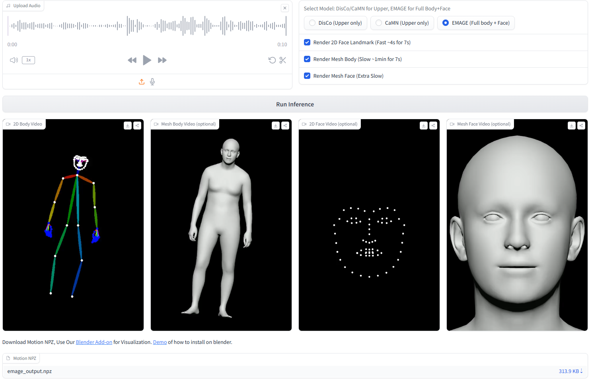
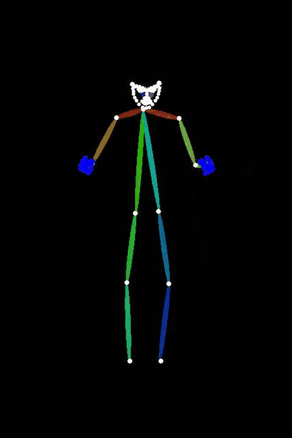

<div align="center">
<h1>PantoMatrix<br>Generating Face and Body Animation from Speech</h1> 
PantoMatrix is an Open-Source and research project to generate 3D body and face animation from speech. 
It works as an API inputs speech audio and outputs body and face motion parameters. 
You may transfer these motion parameters to other formats such as Iphone ARKit Blendshape Weights or Vicon Skeleton bvh files. 
</div>
<!-- [](https://paperswithcode.com/sota/3d-face-animation-on-beat2?p=emage-towards-unified-holistic-co-speech)
[](https://paperswithcode.com/sota/gesture-generation-on-beat2?p=emage-towards-unified-holistic-co-speech) -->

<br>

<div align="center">
    <a href="https://pantomatrix.github.io/EMAGE/"></a>
    <!-- <a href="https://github.com/PantoMatrix/PantoMatrix/blob/main/scripts/EMAGE_2024/readme.md"></a> -->
    <a href="https://www.youtube.com/watch?v=T0OYPvViFGE"></a>
    <a href="https://replicate.com/camenduru/emage"></a>
    <!-- <a href="https://colab.research.google.com/drive/1bB3LqAzceNTW2urXeMpOTPoJYTRoKlzB?usp=sharing"></a> -->
    <a href="https://colab.research.google.com/drive/1MeuZtBv8yUUG9FFeN8UGy78Plk4gzxT4?usp=sharing"></a>
    <a href="https://huggingface.co/spaces/H-Liu1997/EMAGE"></a>
    <a href="https://www.youtube.com/watch?v=T0OYPvViFGE"></a>
</div>

<div align="center">
    <a href="https://pantomatrix.github.io/BEAT/"></a>
    <!-- <a href="https://github.com/PantoMatrix/PantoMatrix/blob/main/scripts/EMAGE_2024/readme.md"></a> -->
    <a href="https://www.youtube.com/watch?v=T0OYPvViFGE"></a>
    <!-- <a href="https://replicate.com/camenduru/emage"></a> -->
    <a href="https://colab.research.google.com/drive/1MeuZtBv8yUUG9FFeN8UGy78Plk4gzxT4?usp=sharing"></a>
    <!-- <a href="https://huggingface.co/spaces/H-Liu1997/EMAGE"></a> -->
    <a href="https://huggingface.co/spaces/H-Liu1997/EMAGE"></a>
    <a href="https://www.youtube.com/watch?v=T0OYPvViFGE"></a>
</div>

<div align="center">
    <a href="https://pantomatrix.github.io/DisCo/"></a>
    <!-- <a href="https://github.com/PantoMatrix/PantoMatrix/blob/main/scripts/EMAGE_2024/readme.md"></a> -->
    <a href="https://www.youtube.com/watch?v=T0OYPvViFGE"></a>
    <a href="https://colab.research.google.com/drive/1MeuZtBv8yUUG9FFeN8UGy78Plk4gzxT4?usp=sharing"></a>
    <!-- <a href="https://replicate.com/camenduru/emage"></a> -->
    <!-- <a href="https://colab.research.google.com/drive/1bB3LqAzceNTW2urXeMpOTPoJYTRoKlzB?usp=sharing"></a> -->
    <!-- <a href="https://huggingface.co/spaces/H-Liu1997/EMAGE"></a> -->
    <a href="https://huggingface.co/spaces/H-Liu1997/EMAGE"></a>
    <a href="https://www.youtube.com/watch?v=T0OYPvViFGE"></a>
</div>

<h2>1. News</h2>

<div align="center">
  
</div>

Welcome volunteers to contribute and collaborate on related topics. Feel free to submit the pull requests! Currently this repo is mainly maintained by haiyangliu1997@gmail.com in freetime since 2022.
 
- **[2025/01]** Demo of how to set up inference and training is available on [Colab](https://colab.research.google.com/drive/1MeuZtBv8yUUG9FFeN8UGy78Plk4gzxT4?usp=sharing)!
- **[2025/01]** New inference api, visualization api, evaluation api, training codebase, are available!
- **[2024/07]** [download smplx motion (in .npz) file](https://huggingface.co/spaces/H-Liu1997/EMAGE), visualize with our blender addon and retarget to your avatar!
- **[2024/04]** Thanks to [@camenduru](https://twitter.com/camenduru), Replicate version EMAGE is available! you can directly call EMAGE via API!
- **[2024/03]** Thanks to [@sunday9999](https://github.com/sunday9999) for speeding up the inference video rendering from 1000s to 25s! 
- **[2024/02]** Thanks to [@wubowen416](https://github.com/wubowen416) for the [scripts of automatic video visualization #83](https://github.com/PantoMatrix/PantoMatrix/issues/83) during inference!
- **[2023/05]** [BEAT_GENEA](https://drive.google.com/file/d/1wYW7eWAYPkYZ7WPOrZ9Z_GIll13-FZfx/view?usp=share_link) is allowed for pretraining in [GENEA2023](https://genea-workshop.github.io/2023/challenge/)! Thanks for GENEA's organizers! 
<!-- - **[2024/03]** EMAGE Demos: [Colab demo](https://colab.research.google.com/drive/1AINafluW6Ba5-KYN_L43eyFK0zRklMvr?usp=sharing), [Gradio demo](https://github.com/PantoMatrix/PantoMatrix/tree/main/scripts/EMAGE_2024#user-content--gradio-demo).
- **[2024/02]** Quick Access: [How to setup EMAGE](https://github.com/PantoMatrix/PantoMatrix/blob/main/scripts/EMAGE_2024/readme.md), [Details of BEAT](https://github.com/PantoMatrix/PantoMatrix/blob/main/scripts/BEAT_2022/readme_beat.md). 🚀!

- **[2022/03]** CaMN training scripts from [anonymous submission](https://github.com/beat2022dataset/beat). -->
<!-- - **[2024/02]** Training and Inference [Scripts](https://github.com/PantoMatrix/PantoMatrix/blob/main/scripts/EMAGE_2024/readme.md) are available for [EMAGE](https://pantomatrix.github.io/EMAGE/). -->
<!-- - **[2023/12]** [EMAGE](https://pantomatrix.github.io/EMAGE/) is available, including BEATX with both FLAME head and SMPLX body parameters.
- **[2023/03]** [Samples](https://drive.google.com/drive/folders/1YLoGaJcrhp9Ap2tsJ4A5xNbKpzmDX6yD?usp=share_link) and [readme](https://github.com/PantoMatrix/BEAT/tree/main/beat2smpl) for SMPL-X body and hands data.
- **[2023/01]** [English data v0.2.1](https://drive.google.com/file/d/1Akf0WgAwuH2fvlWbvNpif4XRqXlpznh9/view?usp=share_link) are available. Fix the orientation issue. See [updation](./docs/updation.md) for details.
- **[2023/01]** Provide checkpoints (#14, #16), scripts for rendering (#17), preprocessing (#18).  
- **[2022/12]** Provide English data in Zip files (#10).
- **[2022/10]** [Project page](https://pantomatrix.github.io/BEAT/) and [rendered videos](https://drive.google.com/drive/folders/1ghZ7_4LkCyM_IZxTElzAwPzGheLrBGBu) are available.
- **[2022/08]** [All languages data v0.1.0](https://drive.google.com/drive/folders/1CVyJOp3G_A9l1N_CsKdHgXQfB4pXhG8c?usp=share_link)  (in separated files) are available. -->

<br>

## 2. Models and Tools List


| Model  | Paper           | Inputs | Outputs**         | Language (Train)         | Full Body FGD | Weights |
|--------|-----------------|--------|------------------|--------------------------|-------------------------------|---------|
| DisCo  | ACMMM 2022     | Audio  | Upper + Hands    | English (Speaker 2) | 2.233                            |    [Link](https://huggingface.co/H-Liu1997/disco_audio/tree/main)     |
| CaMN   | ECCV 2022      | Audio  | Upper + Hands    | English (Speaker 2) | 2.120                         |     [Link](https://huggingface.co/H-Liu1997/camn_audio/tree/main)    |
| EMAGE  | CVPR 2024      | Audio  | Full Body + Face | English (Speaker 2) | 0.615                        |    [Link](https://huggingface.co/H-Liu1997/emage_audio/tree/main)     |

** Outputs are in SMPLX and FLAME parameters. 

|        |                      |                    |                     |
|--------|----------------------|--------------------|---------------------|
| Datasets      | [BEAT2 (SMPLX+FLAME)](https://huggingface.co/datasets/H-Liu1997/BEAT2) | [BEAT (BVH + ARKit)](https://huggingface.co/datasets/H-Liu1997/BEAT)    | [Rendered Skeleton Videos](https://huggingface.co/datasets/H-Liu1997/BEAT_Rendered_Videos) |
| Blender Tools | [Blender Addon](https://huggingface.co/datasets/H-Liu1997/BEAT2_Tools/blob/main/smplx_blender_addon_20230921.zip) | [Character on BEAT](https://huggingface.co/datasets/H-Liu1997/BEAT2_Tools/blob/main/BEAT_Avatars.zip) | [Blender Render Scripts](https://huggingface.co/datasets/H-Liu1997/BEAT2_Tools/blob/main/rendervideo.zip) |
| SMPLX Tools   | [SMPLX-FLAME Model](https://huggingface.co/H-Liu1997/emage_evaltools/blob/main/smplx_models/smplx/SMPLX_NEUTRAL_2020.npz) | [ARKit2FLAME Sripts](https://huggingface.co/datasets/H-Liu1997/BEAT2_Tools/blob/main/ARkit_FLAME.zip) | [ARkit2FLAME Weights](https://huggingface.co/datasets/H-Liu1997/BEAT2_Tools/blob/main/mat_final.npy) |
| Weights       | [FGD on BEAT2](https://huggingface.co/H-Liu1997/emage_evaltools/blob/main/AESKConv_240_100.bin) | [FGD on BEAT](https://huggingface.co/datasets/H-Liu1997/BEAT2_Tools/blob/main/beat_weights/ae_300.bin) | [Text Vocab](https://huggingface.co/datasets/H-Liu1997/BEAT2_Tools/blob/main/emage_weights/vocab.pkl) |


<br>


## 3. Quick Start (Inference)

#### Approach 1: Using Hugging Face Space
Upload your audio and directly download the results from our Hugging Face Space.

<div align="center">
  
</div>

#### Approach 2: Local Setup
Clone the repository and set up locally. <br>
Demo of how to set up is available on [Colab](https://colab.research.google.com/drive/1MeuZtBv8yUUG9FFeN8UGy78Plk4gzxT4?usp=sharing).

```bash
git clone https://github.com/PantoMatrix/PantoMatrix.git
cd PantoMatrix/

bash setup.sh
source /content/py39/bin/activate

python test_camn_audio.py --visualization 
# if you have trouble in install pytroch3d
# use --nopytorch3d, this will not render the 2D openpose style video
python test_camn_audio.py --visualization --nopytorch3d

# try differnet models with your data, put your audio in --audio_folder
# DisCo (ACMMM2022), upper body motion, with data resampling and rhythm content disentanglement.
python test_disco_audio.py --visualization --audio_folder ./examples/audio --save_folder ./examples/motion 
# BEAT (ECCV2022), upper body motion, with body2hands decoder
python test_camn_audio.py --visualization --audio_folder ./examples/audio --save_folder ./examples/motion
# EMAGE (CVPR2024), full body  + face animation 
python test_emage_audio.py --visualization --audio_folder ./examples/audio --save_folder ./examples/motion
```

#### Approach 3: Call API Directly

```python
# copy the ./models folder iin your project folder
from .model.camn_audio import CaMNAudioModel

model = CaMNAudioModel.from_pretrained("H-Liu1997/huggingface-model/camn_audio")
model.cuda().eval()

import librosa
import numpy as np
import torch
# copy the ./emage_utils folder in your project folder
from emage_utils import beat_format_save

audio_np, sr = librosa.load("/audio_path.wav", sr=model.cfg.audio_sr)
audio = torch.from_numpy(audio_np).float().cuda().unsqueeze(0)

motion_pred = model(audio)["motion_axis_angle"]
motion_pred_np = motion_pred.cpu().numpy()
beat_format_save(motion_pred_np, "/result_motion.npz")
```

<br>


## 4. Visualization

When you run the test scripts, 
there is an parameter `--visualization` to automatic enable visualizaion. 
<br>Besides, you could also try visualiztion by the below.

#### Approach 1: Blender (Recommended)
Render the output using Blender by download the [blender addon](https://huggingface.co/datasets/H-Liu1997/BEAT2_Tools/blob/main/smplx_blender_addon_20230921.zip)


#### Approach 2: 3D mesh

```python
# render a npz file to a mesh video
from emage_utils import fast_render
fast_render.render_one_sequence_no_gt("/result_motion.npz", "/audio_path.wav", "/result_video.mp4", remove_global=True)
```

<table class="center">
  <tr>
    <td style="text-align: center"><b>DisCo (Mesh)</b></td>
    <td style="text-align: center"><b>CaMN (Mesh)</b></td>
    <td style="text-align: center"><b>EMAGE (Mesh)</b></td>
  </tr>
  <tr>
    <td style="text-align: center"><a target="_blank" href="./assets/videos/2_scott_0_103_103_output_disco_mesh.mp4"></a></td>
    <td style="text-align: center"><a target="_blank" href="./assets/videos/2_scott_0_103_103_output_camn_mesh.mp4"></a></td>
    <td style="text-align: center"><a target="_blank" href="./assets/videos/2_scott_0_103_103_output_emage_mesh.mp4"></a></td>
  </tr>
</table>

#### Approach 3: 2D OpenPose style video (Require Pytorch3D)

```python
from trochvision.io import write_video
from emage_utils.format_transfer import render2d
from emage_utils import fast_render


motion_dict = np.load(npz_path, allow_pickle=True)
# face
v2d_face = render2d(motion_dict, (512, 512), face_only=True, remove_global=True)
write_video(npz_path.replace(".npz", "_2dface.mp4"), v2d_face.permute(0, 2, 3, 1), fps=30)
fast_render.add_audio_to_video(npz_path.replace(".npz", "_2dface.mp4"), audio_path, npz_path.replace(".npz", "_2dface_audio.mp4"))

# body
v2d_body = render2d(motion_dict, (720, 480), face_only=False, remove_global=True)
write_video(npz_path.replace(".npz", "_2dbody.mp4"), v2d_body.permute(0, 2, 3, 1), fps=30)
fast_render.add_audio_to_video(npz_path.replace(".npz", "_2dbody.mp4"), audio_path, npz_path.replace(".npz", "_2dbody_audio.mp4"))
```


<table class="center">
  <tr>
    <td style="text-align: center"><b>DisCo (2D Pose)</b></td>
    <td style="text-align: center"><b>CaMN (2D Pose)</b></td>
    <td style="text-align: center"><b>EMAGE (2D Pose)</b></td>
    <td style="text-align: center"><b>EMAGE-Face (2D Pose)</b></td>
  </tr>
  <tr>
    <td style="text-align: center"><a target="_blank" href="./assets/videos/2_scott_0_103_103_disco.mp4"></a></td>
    <td style="text-align: center"><a target="_blank" href="./assets/videos/2_scott_0_103_103_output_camn.mp4"></a></td>
    <td style="text-align: center"><a target="_blank" href="./assets/videos/2_scott_0_103_103_output_emage.mp4"></a></td>
    <td style="text-align: center"><a target="_blank" href="./assets/videos/2_scott_0_103_103_output_emage_face.mp4"></a></td>
  </tr>
</table>


<br>

## 5. Evaluation

For academic users, the evaluation code is organized into an evaluation API. 

```python
# copy the ./emage_evaltools folder into your folder
from emage_evaltools.metric import FGD, BC, L1Div, LVDFace, MSEFace

# init
fgd_evaluator = FGD(download_path="./emage_evaltools/")
bc_evaluator = BC(download_path="./emage_evaltools/", sigma=0.3, order=7)
l1div_evaluator= L1div()
lvd_evaluator = LVDFace()
mse_evaluator = MSEFace()

# Example usage
for motion_pred in all_motion_pred:
    # bc and l1 require position representation
    motion_position_pred = get_motion_rep_numpy(motion_pred, device=device, betas=betas)["position"] # t*55*3
    motion_position_pred = motion_position_pred.reshape(t, -1)
    # ignore the start and end 2s, this may for beat dataset only
    audio_beat = bc_evaluator.load_audio(test_file["audio_path"], t_start=2 * 16000, t_end=int((t-60)/30*16000))
    motion_beat = bc_evaluator.load_motion(motion_position_pred, t_start=60, t_end=t-60, pose_fps=30, without_file=True)
    bc_evaluator.compute(audio_beat, motion_beat, length=t-120, pose_fps=30)

    l1_evaluator.compute(motion_position_pred)
    
    face_position_pred = get_motion_rep_numpy(motion_pred, device=device, expressions=expressions_pred, expression_only=True, betas=betas)["vertices"] # t -1
    face_position_gt = get_motion_rep_numpy(motion_gt, device=device, expressions=expressions_gt, expression_only=True, betas=betas)["vertices"]
    lvd_evaluator.compute(face_position_pred, face_position_gt)
    mse_evaluator.compute(face_position_pred, face_position_gt)
    
    # fgd requires rotation 6d representaiton
    motion_gt = torch.from_numpy(motion_gt).to(device).unsqueeze(0)
    motion_pred = torch.from_numpy(motion_pred).to(device).unsqueeze(0)
    motion_gt = rc.axis_angle_to_rotation_6d(motion_gt.reshape(1, t, 55, 3)).reshape(1, t, 55*6)
    motion_pred = rc.axis_angle_to_rotation_6d(motion_pred.reshape(1, t, 55, 3)).reshape(1, t, 55*6)
    fgd_evaluator.update(motion_pred.float(), motion_gt.float())
    
metrics = {}
metrics["fgd"] = fgd_evaluator.compute()
metrics["bc"] = bc_evaluator.avg()
metrics["l1"] = l1_evaluator.avg()
metrics["lvd"] = lvd_evaluator.avg()
metrics["mse"] = mse_evaluator.avg()
```

Hyperparameters may vary depending on the dataset. 
<br> For example, for the BEAT dataset, we use `(0.3, 7)`; for the TalkShow dataset, we use `(0.5, 7)`. You may adjust based on your data.

<br>

## 6. Training

This new codebase only have the audio-only version model for better real-world applications. <br>For reproducing audio+text results in the paper, please check and reference the previous codebase below.

| Model  | Inputs (Paper)      | Old Codebase | Input (Current Codebase)  | 
|--------|---------------------|-----------------------------|---------------------|
| DisCo  | Audio + Text        |    [link](https://github.com/PantoMatrix/PantoMatrix/tree/6ca70b9541285b124da2eeedcd80f7c5a54eb111/scripts/DisCo_2022)                         | Audio               |       
| CaMN   | Audio + Text + Emotion + Facial |      [link](https://github.com/PantoMatrix/PantoMatrix/tree/6ca70b9541285b124da2eeedcd80f7c5a54eb111/scripts/BEAT_2022)               | Audio               |          
| EMAGE  | Audio + Text        | [link](https://github.com/PantoMatrix/PantoMatrix/tree/6ca70b9541285b124da2eeedcd80f7c5a54eb111/scripts/EMAGE_2024)                      | Audio               |     


#### Before Start

Environment setup, skip if you already setup the inference.
```bash

# if you didn't run test, run the below four commands.
# git clone https://github.com/PantoMatrix/PantoMatrix.git
# cd PantoMatrix/
# bash setup.sh
# source /content/py39/bin/activate

# Download the BEAT2
sudo apt-get update
sudo apt-get install git-lfs
git lfs install
git clone https://huggingface.co/datasets/H-Liu1997/BEAT2
```

Your folder should like follows for the correct path
```bash
/your_root/
|-- PantoMatrix
   |-- BEAT2
   `-- train_emage_audio.py
```

####  Method 1: Training EMAGE

#### 
```bash
# Preprocessing Extract the foot contact data
python ./datasets/foot_contact.py

# (todo) train the vqvae

# train the audio2motion model
torchrun --nproc_per_node 1 --nnodes 1 train_emage_audio.py --config ./configs/emage_audio.yaml --evaluation
```
Use these flags as needed:

- `--evaluation`: Calculate the test metric.
- `--wandb`: Activate logging to WandB.
- `--visualization`: Render test results (slow; disable for efficiency).
- `--test`: Test mode; load last checkpoint and evaluate.
- `--debug`: Debug mode; iterate one data point for fast testing.


#### Method 2: Training CaMN

```bash
torchrun --nproc_per_node 1 --nnodes 1 train_camn_audio.py --config ./configs/camn_audio.yaml --evaluation
```

#### Method 3: Training DisCo

```bash
# (optional) Extract the cluster information
# python ./datasets/clustering.py

# train audio2motion 
torchrun --nproc_per_node 1 --nnodes 1 train_disco_audio.py --config ./configs/disco_audio.yaml --evaluation
```

<br>

<h2> Reference </h2>

<div align="center">
<h2>
EMAGE: Towards Unified Holistic Co-Speech Gesture Generation via Expressive Masked Audio Gesture Modeling (CVPR 2024)

<h4>
<a href="https://h-liu1997.github.io/">Haiyang Liu</a>*,
<a href="https://zzhat0706.github.io/PersonalPage/">Zihao Zhu</a>*,
<a href="https://ps.is.mpg.de/person/gbecherini">Giorgio Becherini</a>, 
<a href="https://scholar.google.com/citations?user=9sWVrREAAAAJ&hl=en">Yichen Peng</a>,
<a>Mingyang Su</a>,
<a>You Zhou</a>,
<a href="https://iwanao731.github.io/">Naoya Iwamoto</a>,
<a href="http://www.bozheng-lab.com/">Bo Zheng</a>,
<a href="https://ps.is.mpg.de/person/black">Michael J. Black</a>
<br>
<br>
<sup>(*Equal Contribution)</sup>
<sub>
</div>

<p align="center">

</p>

<p align="center">
-
<a href="https://pantomatrix.github.io/EMAGE/">Project Page</a>
-
<a href="https://arxiv.org/abs/2401.00374">Paper</a>
-
<a href="https://www.youtube.com/watch?v=T0OYPvViFGE">Video</a>
-
<a href="https://github.com/PantoMatrix/PantoMatrix/tree/main/scripts/EMAGE_2024">Code</a>
-
<a href="https://colab.research.google.com/drive/1AINafluW6Ba5-KYN_L43eyFK0zRklMvr?usp=sharing">Demo</a>
-
<a href="https://drive.google.com/drive/folders/1ukbifhHc85qWTzspEgvAxCXwn9mK4ifr">Dataset</a>
-
<a href="https://drive.google.com/drive/folders/1ukbifhHc85qWTzspEgvAxCXwn9mK4ifr">Blender Add-On</a>
-
</p>

<p align=center>
    <a href="https://www.youtube.com/watch?v=T0OYPvViFGE">
    
    </a>
</p>

------------
<div align="center">
<h2>
BEAT: A Large-Scale Semantic and Emotional Multi-Modal Dataset for Conversational Gestures Synthesis (ECCV 2022)
<h4>
<a href="https://h-liu1997.github.io/">Haiyang Liu</a>,
<a href="https://zzhat0706.github.io/PersonalPage/">Zihao Zhu</a>,
<a href="https://iwanao731.github.io/">Naoya Iwamoto</a>,
<a href="https://scholar.google.com/citations?user=9sWVrREAAAAJ&hl=en">Yichen Peng</a>,
<a href="https://scholar.google.co.jp/citations?user=hgCoNowAAAAJ&hl=ja">Zhengqing Li</a>,
<a>You Zhou</a>,
<a href="https://scholar.google.com.sg/citations?user=Bm1TcmsAAAAJ&hl=en">Elif Bozkurt</a>,
<a href="http://www.bozheng-lab.com/">Bo Zheng</a>
</div>

<p align="center">

</p>

<p align="center">
-
<a href="https://pantomatrix.github.io/BEAT/">Project Page</a>
-
<a href="https://www.ecva.net/papers/eccv_2022/papers_ECCV/papers/136670605.pdf">Paper</a>
-
<a href="https://www.youtube.com/watch?v=F6nXVTUY0KQ">Video</a>
-
<a href="https://github.com/PantoMatrix/PantoMatrix/tree/main/scripts/BEAT_2022">Code</a>
-
<a href="https://colab.research.google.com/drive/1bB3LqAzceNTW2urXeMpOTPoJYTRoKlzB?usp=sharing">Colab Demo</a>
-
<a href="https://pantomatrix.github.io/BEAT-Dataset/">Dataset</a>
-
<a href="https://paperswithcode.com/sota/gesture-generation-on-beat?p=beat-a-large-scale-semantic-and-emotional">Benchmark</a>
-
</p>

<p align=center>
    <a href="https://www.youtube.com/watch?v=F6nXVTUY0KQ">
    
    </a>
</p>

------------
<div align="center">
<h2>
DisCo: Disentangled Implicit Content and Rhythm Learning for Diverse Co-Speech Gesture Synthesis (ACMMM 2022)
<h4>
<a href="https://h-liu1997.github.io/">Haiyang Liu</a>,
<a href="https://iwanao731.github.io/">Naoya Iwamoto</a>,
<a href="https://zzhat0706.github.io/PersonalPage/">Zihao Zhu</a>,
<a href="https://scholar.google.co.jp/citations?user=hgCoNowAAAAJ&hl=ja">Zhengqing Li</a>,
<a>You Zhou</a>,
<a href="https://scholar.google.com.sg/citations?user=Bm1TcmsAAAAJ&hl=en">Elif Bozkurt</a>,
<a href="http://www.bozheng-lab.com/">Bo Zheng</a>
</div>


<p align="center">
-
<a href="https://pantomatrix.github.io/DisCo/">Project Page</a>
-
<a href="https://dl.acm.org/doi/abs/10.1145/3503161.3548400">Paper</a>
-
<a href="https://www.youtube.com/watch?v=Nd6NX27ykgA">Video</a>
-
<a href="https://github.com/PantoMatrix/PantoMatrix/tree/main/scripts/DisCo_2022">Code</a>
-
</p>

<p align=center>
    <a href="https://www.youtube.com/watch?v=Nd6NX27ykgA">
    
    </a>
</p>


