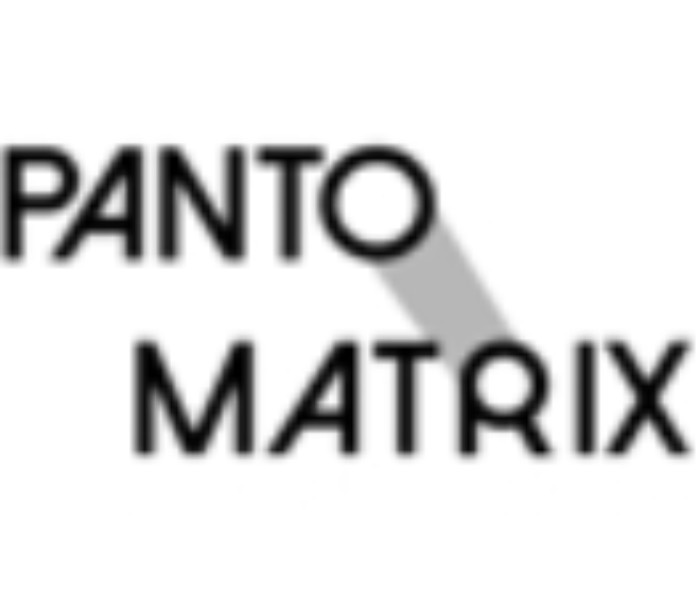
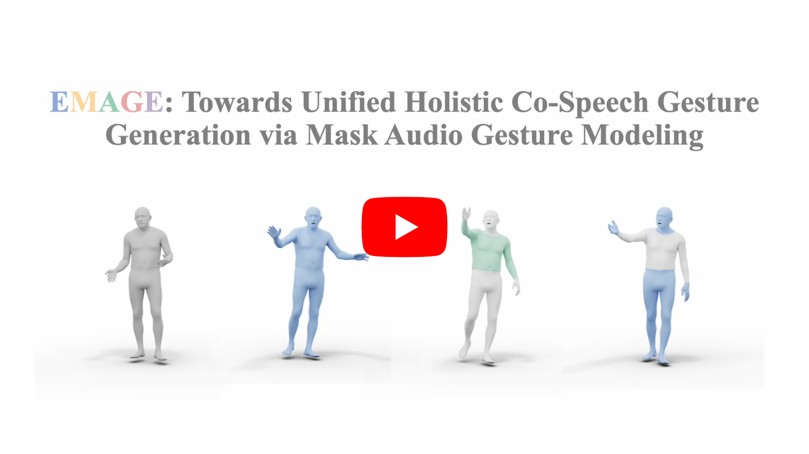
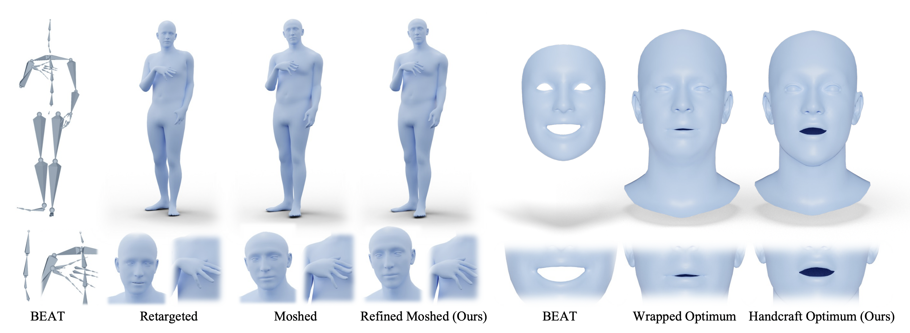
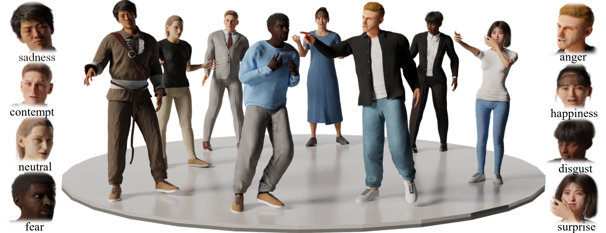
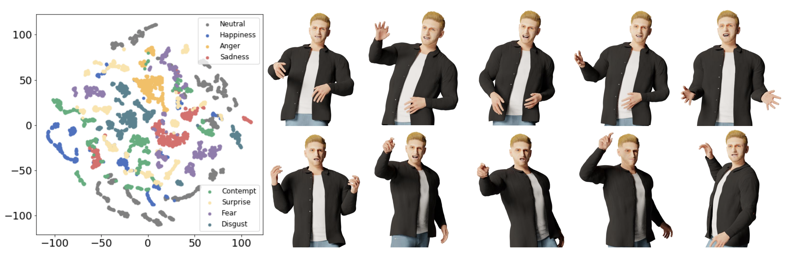
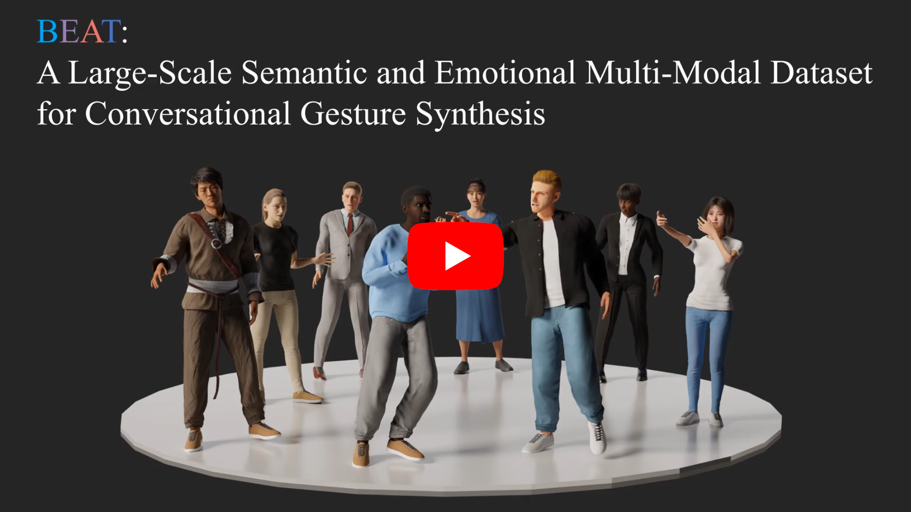
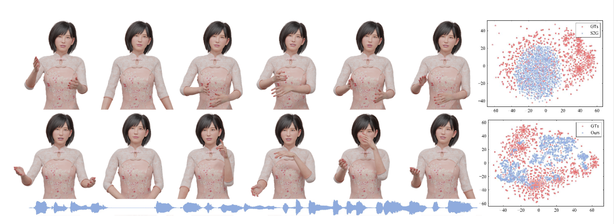
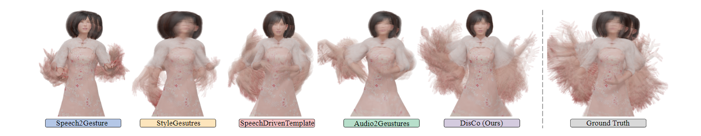
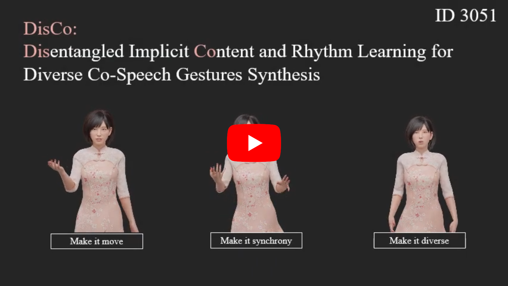
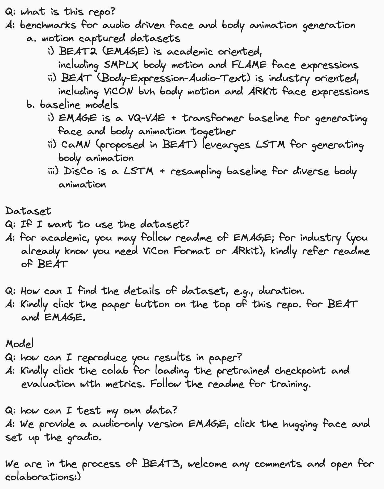

<!-- 
  
 -->
<h2>PantoMatrix: Talking Face and Body Animation Generation</h2> 

 

 

# 🎨 Pin

Thanks to [@camenduru](https://twitter.com/camenduru), Replicate version EMAGE is available! you can directly call EMAGE via API!

Hugging face space is available! Try to drive SMPLX with your custom audio [here](https://huggingface.co/spaces/H-Liu1997/EMAGE)!

# News

Welcome contributors for speedup the training, better visualization etc. Feel free to submit the pull requests! 
- **[2024/07]** Now you could [download smplx motion (in .npz) file](https://huggingface.co/spaces/H-Liu1997/EMAGE), visualize with our blender addon and retarget to your avatar!
- **[2024/03]** Thanks [@sunday9999](https://github.com/sunday9999) for speeding up the inference video rendering from 1000s to 25s! 
- **[2024/03]** EMAGE Demos: [Colab demo](https://colab.research.google.com/drive/1AINafluW6Ba5-KYN_L43eyFK0zRklMvr?usp=sharing), [Gradio demo](https://github.com/PantoMatrix/PantoMatrix/tree/main/scripts/EMAGE_2024#user-content--gradio-demo).
- **[2024/02]** Quick Access: [How to setup EMAGE](https://github.com/PantoMatrix/PantoMatrix/blob/main/scripts/EMAGE_2024/readme.md), [Details of BEAT](https://github.com/PantoMatrix/PantoMatrix/blob/main/scripts/BEAT_2022/readme_beat.md). 🚀!
- **[2024/02]** Thanks [@wubowen416](https://github.com/wubowen416) for the [scripts of automatic video visualization #83](https://github.com/PantoMatrix/PantoMatrix/issues/83) during inference!
- **[2024/02]** Training and Inference [Scripts](https://github.com/PantoMatrix/PantoMatrix/blob/main/scripts/EMAGE_2024/readme.md) are available for [EMAGE](https://pantomatrix.github.io/EMAGE/).
- **[2023/12]** [EMAGE](https://pantomatrix.github.io/EMAGE/) is available, including BEATX with both FLAME head and SMPLX body parameters.
- **[2023/05]** [BEAT_GENEA](https://drive.google.com/file/d/1wYW7eWAYPkYZ7WPOrZ9Z_GIll13-FZfx/view?usp=share_link) is allowed for pretraining in [GENEA2023](https://genea-workshop.github.io/2023/challenge/)! Thanks for GENEA's organizers! 
- **[2023/03]** [Samples](https://drive.google.com/drive/folders/1YLoGaJcrhp9Ap2tsJ4A5xNbKpzmDX6yD?usp=share_link) and [readme](https://github.com/PantoMatrix/BEAT/tree/main/beat2smpl) for SMPL-X body and hands data.
- **[2023/01]** [English data v0.2.1](https://drive.google.com/file/d/1Akf0WgAwuH2fvlWbvNpif4XRqXlpznh9/view?usp=share_link) are available. Fix the orientation issue. See [updation](./docs/updation.md) for details.
- **[2023/01]** Provide checkpoints (#14, #16), scripts for rendering (#17), preprocessing (#18).  
- **[2022/12]** Provide English data in Zip files (#10).
- **[2022/10]** [Project page](https://pantomatrix.github.io/BEAT/) and [rendered videos](https://drive.google.com/drive/folders/1ghZ7_4LkCyM_IZxTElzAwPzGheLrBGBu) are available.
- **[2022/08]** [All languages data v0.1.0](https://drive.google.com/drive/folders/1CVyJOp3G_A9l1N_CsKdHgXQfB4pXhG8c?usp=share_link)  (in separated files) are available.
- **[2022/03]** CaMN training scripts from [anonymous submission](https://github.com/beat2022dataset/beat).

------------
<!-- **CoRR 2024**  -->
**CVPR 2024** 
**EMAGE: Towards Unified Holistic Co-Speech Gesture Generation via Expressive Masked Audio Gesture Modeling** 

<a href="https://h-liu1997.github.io/">Haiyang Liu</a>\*,
<a href="https://zzhat0706.github.io/PersonalPage/">Zihao Zhu</a>\*,
<a href="https://ps.is.mpg.de/person/gbecherini">Giorgio Becherini</a>, 
<a href="https://scholar.google.com/citations?user=9sWVrREAAAAJ&hl=en">Yichen Peng</a>,
<a>Mingyang Su</a>,
<a>You Zhou</a>,
<a href="https://iwanao731.github.io/">Naoya Iwamoto</a>,
<a href="http://www.bozheng-lab.com/">Bo Zheng</a>,
<a href="https://ps.is.mpg.de/person/black">Michael J. Black</a>\

(*Equal Contribution)

------------

We propose EMAGE, a framework to generate full-body human gestures from audio and masked gestures, encompassing facial, local body, hands, and global movements. To achieve this, we first introduce BEATX (BEAT-SMPLXFLAME), a new mesh-level holistic co-speech dataset. BEATX combines MoShed SMPLX body with FLAME head parameters and further refines the modeling of head, neck, and finger movements, offering a community-standardized, high-quality 3D motion captured dataset. EMAGE leverages masked body gesture priors during training to boost inference performance. It involves a Masked Audio Gesture Transformer, facilitating joint training on audio-togesture generation and masked gesture reconstruction to effectively encode audio and body gesture hints. Encoded body hints from masked gestures are then separately employed to generate facial and body movements. Moreover, EMAGE adaptively merges speech features from the audio’s rhythm and content and utilizes four compositional VQVAEs to enhance the results’ fidelity and diversity. Experiments demonstrate that EMAGE generates holistic gestures with state-of-the-art performance and is flexible in accepting predefined spatial-temporal gesture inputs, generating complete, audio-synchronized results.

-
<a href="https://pantomatrix.github.io/EMAGE/">Project Page</a>
-
<a href="https://arxiv.org/abs/2401.00374">Paper</a>
-
<a href="https://www.youtube.com/watch?v=T0OYPvViFGE">Video</a>
-
<a href="https://github.com/PantoMatrix/PantoMatrix/tree/main/scripts/EMAGE_2024">Code</a>
-

-
<a href="https://drive.google.com/drive/folders/1ukbifhHc85qWTzspEgvAxCXwn9mK4ifr">Dataset</a>
-
<a href="https://drive.google.com/drive/folders/1ukbifhHc85qWTzspEgvAxCXwn9mK4ifr">Blender Add-On</a>
-

    

<!-- 

-
<a>Data Processing</a>
-

 -->

------------

**ECCV 2022** 
**BEAT: A Large-Scale Semantic and Emotional Multi-Modal Dataset for Conversational Gestures Synthesis** 

<a href="https://h-liu1997.github.io/">Haiyang Liu</a>,
<a href="https://zzhat0706.github.io/PersonalPage/">Zihao Zhu</a>,
<a href="https://iwanao731.github.io/">Naoya Iwamoto</a>,
<a href="https://scholar.google.com/citations?user=9sWVrREAAAAJ&hl=en">Yichen Peng</a>,
<a href="https://scholar.google.co.jp/citations?user=hgCoNowAAAAJ&hl=ja">Zhengqing Li</a>,
<a>You Zhou</a>,
<a href="https://scholar.google.com.sg/citations?user=Bm1TcmsAAAAJ&hl=en">Elif Bozkurt</a>,
<a href="http://www.bozheng-lab.com/">Bo Zheng</a>

------------

Achieving realistic, vivid, and human-like synthesized conversational gestures conditioned on multi-modal data is still an unsolved problem due to the lack of available datasets, models and standard evaluation metrics. To address this, we build Body-Expression-Audio-Text dataset, BEAT, which has i) 76 hours, high-quality, multi-modal data captured from 30 speakers talking with eight different emotions and in four different languages, ii) 32 millions frame-level emotion and semantic relevance annotations. Our statistical analysis on BEAT demonstrates the correlation of conversational gestures with facial expressions, emotions, and semantics, in addition to the known correlation with audio, text, and speaker identity. Based on this observation, we propose a baseline model, Cascaded Motion Network (CaMN), which consists of above six modalities modeled in a cascaded architecture for gesture synthesis. To evaluate the semantic relevancy, we introduce a metric, Semantic Relevance Gesture Recall (SRGR). Qualitative and quantitative experiments demonstrate metrics’ validness, ground truth data quality, and baseline’s state-of-the-art performance. To the best of our knowledge, BEAT is the largest motion capture dataset for investigating human gestures, which may contribute to a number of different research fields, including controllable gesture synthesis, cross-modality analysis, and emotional gesture recognition.

-
<a href="https://pantomatrix.github.io/BEAT/">Project Page</a>
-
<a href="https://www.ecva.net/papers/eccv_2022/papers_ECCV/papers/136670605.pdf">Paper</a>
-
<a href="https://www.youtube.com/watch?v=F6nXVTUY0KQ">Video</a>
-
<a href="https://github.com/PantoMatrix/PantoMatrix/tree/main/scripts/BEAT_2022">Code</a>
-

-
<a href="https://pantomatrix.github.io/BEAT-Dataset/">Dataset</a>
-
<a href="https://paperswithcode.com/sota/gesture-generation-on-beat?p=beat-a-large-scale-semantic-and-emotional">Benchmark</a>
-

    

<!-- 

-
<a>Data Distribution</a>
-

 -->

------------

**ACMMM 2022** 
**DisCo: Disentangled Implicit Content and Rhythm Learning for Diverse Co-Speech Gesture Synthesis** 

<a href="https://h-liu1997.github.io/">Haiyang Liu</a>,
<a href="https://iwanao731.github.io/">Naoya Iwamoto</a>,
<a href="https://zzhat0706.github.io/PersonalPage/">Zihao Zhu</a>,
<a href="https://scholar.google.co.jp/citations?user=hgCoNowAAAAJ&hl=ja">Zhengqing Li</a>,
<a>You Zhou</a>,
<a href="https://scholar.google.com.sg/citations?user=Bm1TcmsAAAAJ&hl=en">Elif Bozkurt</a>,
<a href="http://www.bozheng-lab.com/">Bo Zheng</a>

------------

Current co-speech gestures synthesis methods struggle with generating diverse motions and typically collapse to single or few frequent motion sequences, which are trained on original data distribution with customized models and strategies. We tackle this problem by temporally clustering motion sequences into content and rhythm segments and then training on content-balanced data distribution. In particular, by clustering motion sequences, we have observed for each rhythm pattern, some motions appear frequently, while others appear less. This imbalance results in the difficulty of generating low frequent occurrence motions and it cannot be easily solved by resampling, due to the inherent many-tomany mapping between content and rhythm. Therefore, we present DisCo, which disentangles motion into implicit content and rhythm features by contrastive loss for adopting different data balance strategies. Besides, to model the inherent mapping between content and rhythm features, we design a diversity-and-inclusion network (DIN), which firstly generates content features candidates and then selects one candidate by learned voting. Experiments on two public datasets, Trinity and S2G-Ellen, justify that DisCo generates more realistic and diverse motions than state-of-the-art methods.

-
<a href="https://pantomatrix.github.io/DisCo/">Project Page</a>
-
<a href="https://dl.acm.org/doi/abs/10.1145/3503161.3548400">Paper</a>
-
<a href="https://www.youtube.com/watch?v=Nd6NX27ykgA">Video</a>
-
<a href="https://github.com/PantoMatrix/PantoMatrix/tree/main/scripts/DisCo_2022">Code</a>
-

    

Notes
============

  

Copyright Information
============
The website is inspired by the template of <a href="https://github.com/sebastianstarke/AI4Animation">AI4Animation</a>.\
This project is only for research or education purposes, and not freely available for commercial use or redistribution. The motion capture data is available only under the terms of the [Attribution-NonCommercial 4.0 International](https://creativecommons.org/licenses/by-nc/4.0/legalcode) (CC BY-NC 4.0) license.
